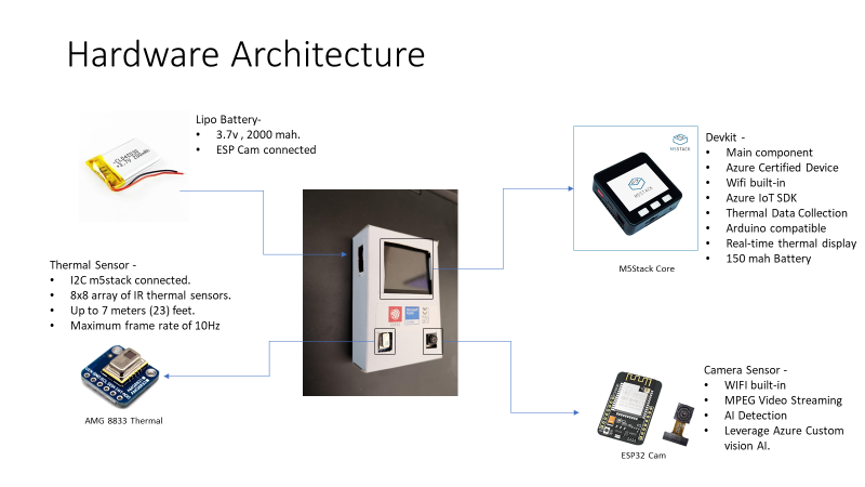

# Project-AICARE
Project AI CARE for thermal and face mask detection , Plese refer the detail steps on Hands-ond Guide(./Proejct AI Care Hands-On Guide.pdf)
# Demo Video : 
##	1. AI Care Edge Demo - https://youtu.be/Wh_21go4Thg
##	2. AI Care Device hands-on -  https://youtu.be/d4HqonLCNmM 
##	3. Mask Training by Custom Vision -  https://youtu.be/eEb9vfvgW0g 
##	4. Mask Inference Demo with Custom Vision on IoT Edge - https://youtu.be/dXDriffeE6Q 

## AI CARE System Architecture –

**System Overview**

1.  Mask Training –
2.  IoT Edge –
3.  IoT Central –
4.  BoT Service –
5.  Power BI + CosmosDB –

6.  **Hands-On Guide Tutorial** -
-   **Device Side**
    - 6.1.  M5StackCore or Any other Azure Certified Device or Rasiperry Pi –
        1.  Development & Pinout Reference –
            <https://docs.m5stack.com/#/en/quick_start/m5core/m5stack_core_get_started_Arduino_Windows>

        2.  Git clone from - <https://github.com/tommywu052/project-AICARE.git> 
        > Reference from https://github.com/m600x/M5Stack-Thermal-Camera 

        3.  Go to
        [project-AICARE](https://github.com/tommywu052/project-AICARE)/[device](https://github.com/tommywu052/project-              AICARE/tree/master/device)/**M5Stack_Thermal**/,
        modify the code as below for your own wifi ssid / password and Azure IoT
        Central device connection string.

    - 6.2.  ESP32 CAM or Any other CSI Camera component –

       1. Development & Pinout Reference –
    <https://www.instructables.com/id/ESP-32-Camera-Streaming-Video-Over-WiFi-Getting-St/>
    - 6.3.  AMG 8833 or MLX90640 Thermal Camera –

-   **Backend Side** –

    1.  Mask Training with Azure Custom Vision –

    2.  Download Kiosk App : <http://aka.ms/kioskapp>

    3.  Setting your training & prediction key in kiosk app from
    <https://www.customvision.ai/> website.

    4.  Edge Computing with Azure IoT Edge -

        1.  Refer the document
        *https://github.com/Azure-Samples/Custom-vision-service-iot-edge-raspberry-pi/tree/master/*
        for IoT Edge setup, remember to choose amd64 for x64 platform.

        2.  Install the node-red IoT Edge module as -
        <https://github.com/iotblackbelt/noderededgemodule>

        3.  Import the code from
        <https://github.com/tommywu052/project-AICARE/blob/master/backend/IoTEdge/AICare-nodered-flows.json>
        into your node-red edge.

    5.  Get the inference code from -
    *https://github.com/tommywu052/project-AICARE/blob/master/backend/IoTEdge/yolocv-public.py*

        1. Modify the code - line 22-24 as your device key on IoT Central :

        2. Modify the code – line 63 as your image inference host at 5.5.1 step

        3. Modify the code – line 261 as your ESP32 CAM streaming IP
       (ex:192.168.43.138, port 81 is default MJPEG streaming )

    6.  Power BI Dashboard -

        1.  Refer the document for Real-Time Streaming –
            <https://docs.microsoft.com/zh-tw/power-bi/service-real-time-streaming>

        2.  Add Real-Time widget with Web Content and Streaming data set -

        >   <https://docs.microsoft.com/zh-tw/power-bi/service-dashboard-add-widget>

        3.  Note – Data on real-time dashboard is coming from IoT Central export as
            Azure Event Hubs-

    7.  IoT Device Control and Monitoring on IoT Central -

        1.  Refer the document to Create Your IoT Central Dashboard Application -
            <https://docs.microsoft.com/zh-tw/azure/iot-central/core/quick-deploy-iot-central>

        2.  Device Configuration –

        >   Configure your device telemetry/settings/command/triggers on the device
        >   template (mapping the code on the device side Arduino and python code)

        3.  Enable Alert Notification –

        >   <https://docs.microsoft.com/zh-tw/azure/iot-central/core/quick-configure-rules>

        

        4.  If you just want to copy my existing application template quickly , Please
    create your application based my share template, click the below -
    <https://apps.azureiotcentral.com/build/new/7490af0a-4e9c-4b54-b7a6-bd0c6092e522>

    8.  (To-Do) Azure BOT service integration –
        1. Check this for more detail notification -
        <https://docs.microsoft.com/zh-tw/azure/bot-service/bot-builder-tutorial-basic-deploy?view=azure-bot-service-4.0&tabs=csharp>

        2. LINE Integration -
        <https://docs.microsoft.com/zh-tw/azure/bot-service/bot-service-channel-connect-line?view=azure-bot-service-4.0>

 **Feedback** -

Welcome and Improve the code based on your advanced requirement .Please contact
<towu@microsoft.com> or submit request on the github. Thanks !
